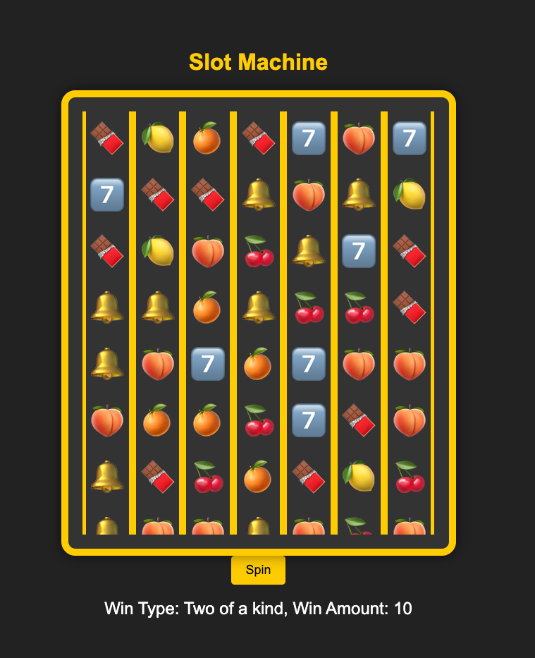

### Slot Machine Project

This project implements a simple slot machine game with a backend written in Go and a frontend using HTML, CSS, and JavaScript. The backend provides the slot machine logic and determines the result of each spin, while the frontend displays the slot machine interface and handles the animations.

#### Project Structure

- **backend**: Contains the Go server code.
- **frontend**: Contains the HTML, CSS, and JavaScript files for the slot machine UI.

#### Requirements

- Go 1.15 or later
- Python 3.x (for serving the frontend)

#### Setup and Installation

1. **Clone the repository**:
   ```sh
   git clone https://github.com/yourusername/slot-machine.git
   cd slot-machine
   ```

2. **Backend Setup**:
    - Navigate to the `backend` directory:
      ```sh
      cd backend
      ```
    - Run the Go server:
      ```sh
      go run main.go
      ```
    - The server will start on `http://localhost:8080`.

3. **Frontend Setup**:
    - Navigate to the `frontend` directory:
      ```sh
      cd frontend
      ```
    - Serve the HTML file using Python:
      ```sh
      python3 -m http.server 8000
      ```
    - Open your browser and navigate to `http://localhost:8000` to see the slot machine.

#### Backend Code Overview (`main.go`)

- **SpinResult**: Struct for JSON response.
- **getRandomSymbols**: Generates random symbols for the slot machine.
- **calculateWin**: Calculates the win type and amount based on the symbols.
- **spinHandler**: Handles the `/spin` endpoint, generates the spin result, and calculates the win.
- **main**: Starts the HTTP server on port 8080.

#### Frontend Code Overview (`index.html`)

- **HTML**: Basic structure with a slot machine UI.
- **CSS**: Styles for the slot machine.
- **JavaScript**:
    - `spin()`: Fetches the result from the backend and starts the reel animation.
    - `animateReels()`: Animates the reels to spin and stop at the correct symbols.
    - `stopReel()`: Stops each reel at the specified symbol.
    - `displayResult()`: Displays the win type and amount.
# casino
